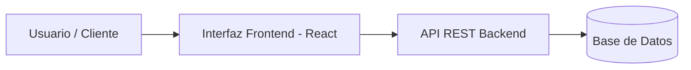

# Practica--Laboratorio-5

Proyecto desarrollado para el Laboratorio N° 5 de Diseño de Interfaces Avanzado.  Implementa la documentación profesional de una aplicación web, aplicando la sintaxis avanzada de GitHub Flavored Markdown (GFM) para estructurar el flujo, arquitectura y funcionalidades del sistema.

## Tabla de contenidos 
- [Descripción](#descripción) 
- [Instalación](#instalación) 
- [Uso](#uso) 
- [Contribuidores](#contribuidores) 

## Instalación 
```bash 
git clone https://github.com/TU-USUARIO/laboratorio-readme.git 
cd laboratorio-readme 
npm install 
```

## Estado de funcionalidades
| Función | Estado |
| --- | --- |
| Autenticación de usuarios | Listo |
| Búsqueda de catálogo | Listo |
| Reserva de libros | En progreso |
| Reportes de préstamos | Pendiente |

## Pendientes
- [x] Diseñar el prototipo de la interfaz en Figma
- [x] Configurar la estructura base del proyecto
- [ ] Integrar pasarela de pago para multas
- [ ] Realizar pruebas de usabilidad con usuarios

## Arquitectura


## Contribuidores
* **Lucero Calderón** - *Desarrolladora Principal* - [@lucerocalderon-dev](https://github.com/lucerocalderon-dev)